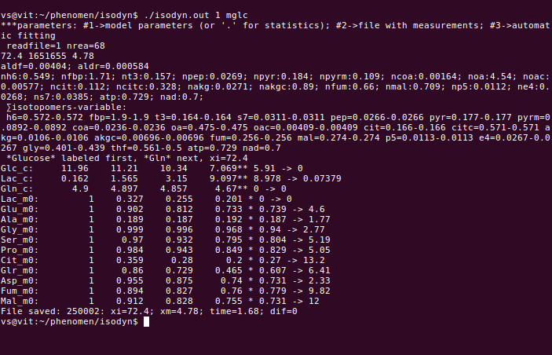

# IsoDyn
Version: 1.0
## Short Description

“C++”-program simulating the dynamics of metabolites and their isotopic isomers in central metabolic network using kinetic model

## Description

“Isodyn” is a C++-program that performs an analysis of stable isotope tracer data to assess metabolic flux profiles in living cells. Isodyn simulates the dynamics of isotopic isomer (isotopomer) distribution in central metabolic pathways, and, by changing its parameters, which reflect the characteristics of corresponding biochemical reactions, fit the simulated dynamics of mass isotopomers to that observed experimentally. The simulated metabolic fluxes that correspond to the best fit are assumed to reproduce the real fluxes in the analyzed biological object and conditions. Isodyn contains tools that check the goodness of fit and perform a statistical analysis of obtained metabolic fluxes.

## Key features

- simulation of concentrations of 13C isotopomers originated from artificially 13C enriched substrates, obtained using mass spectrometry and corrected for natural occurring isotopes and peaks overlapping

## Functionality

- Post-processing
- Statistical Analysis
- Workflows

## Approaches

- Isotopic Labelling Analysis / 13C
    
## Data Analysis

- simulation of the mass isotopomer data, fitting them using a kinetic nodel, evaluation of metabolic fluxes corresponding to the best fit

## Instrument Data Types

- MS

## Screenshots

- screenshot of input data (format Metabolights), output is the same format with one more column added: corrected mass spectrum



## Tool Authors

- Vitaly Selivanov (Universitat de Barcelona)

## Container Contributors

- [Pablo Moreno](EBI)

## Website

- N/A

## Git Repository

- https://github.com/seliv55/isodyn

## Installation

- 1) As independent program. IsoDyn only requires compillation. Standing in the IsoDyn directory enter the commands:
  
```
  make clean 

  make 
```
  
  
- 2) As Docker image. To create the Docker container: 
     - go to the directory where the dockerfile is;
     - create container from dockerfile:
     
```
 sudo docker build -t isodyn:0.2 . 
```

## Usage Instructions

  To run Isodyn, general form:
 
```
 sudo docker run -i -t -v $PWD:/data isodyn:0.2 <parameters>
```
  To facilitate the program execution a shell script "dokiso.sh" is provided, that use some default values for the parameters:
```
#!/bin/sh
fiso="/data/SW620-Glucose"    # input data: file indicating 13C labeling of metabolites
fcon=/data/xglc               # input data: file with measured concentrations
inpar="/data/glc/1"           # input data: initial set of parameters to start
oudir="/data/glc/"            # output directory
fstat="/data/glc/statfl"      # path to write the results of fitting: mean and confidence intervals
fcmpr="/data/glc/statfl"      # results of fitting for the conditions used for comparison.
manfi=77                # number of files to be saved during fitting
FNCKAS="0"              # a number of options forsing Isodyn to run in various modes. Default: make one simulation and stop
tst=yes                 # run Isodyn?
while getopts ":a:b:i:o:s:c:m:FNCKAS" opt; do
  case $opt in
    a) fiso=$OPTARG;;
    b) fcon=$OPTARG;;
    i) inpar=$OPTARG;;
    o) oudir=$OPTARG;;
    s) fstat=$OPTARG;;
    c) fcmpr=$OPTARG;;
    m) manfi=$OPTARG;;
    F) FNCKAS=F;;     # fit data using Simulated Annealing algorithm
    N) FNCKAS=N;;     # find the number of degrees of freedom for estimation of goodness of fit.
    C) FNCKAS=C;;     # attempts to increase confidence intervals for fluxes
    K) FNCKAS=K;;     # special algorithm for fitting transketolase parameters
    A) FNCKAS=A;;     # special algorithm for fitting transaldolase parameters
    S) FNCKAS=S;;     # statistics on the results of fitting: mean and confidence intervals for fluxes
    *)
      echo "Invalid option: -$OPTARG" 
      cat help
      tst=no
      ;;
  esac
done
if [ $tst = yes ]
then                  # run Isodyn
sudo docker run -i -t -v $PWD:/data isodyn:0.2 $fiso $fcon $inpar $oudir $fstat $fcmpr $manfi $FNCKAS
fi
```
  Here for the docker image the name /data/ is assigned to the current directory and all paths are considered respectively to the current directory. Using this script, the command for execution of the docker image with default values of parameters is 
```
 ./dokiso.sh
```
- performing optimization using Simulated Annealing algorithm minimizing χ2 and stop after saving 33 files with optimized parameters in the output directory:
 
```
 ./dokiso.sh -F -m 33
```

- Statistics for fluxes, saved in the files  "1", "2", etc, in the directory /out, saving the result in ./abc/efg.csv:

```
 ./dokiso.sh -S -s /data/abc/efg.csv
```

- run test1 using the script presented inthe directory of dockerfile and data uploaded to https://drive.google.com/drive/u/0/folders/0B1lAg6jyw6lvUkQ5V05LRGpuS0E
 
```
sudo docker run -it --entrypoint=runTest1.sh isodyn:0.2 
```
 
## Publications

- 1: Selivanov VA, Vizán P, Mollinedo F, Fan TW, Lee PW, Cascante M.
Edelfosine-induced metabolic changes in cancer cells that precede the
overproduction of reactive oxygen species and apoptosis. BMC Syst Biol. 2010, 4:135.

- 2: de Mas IM, Selivanov VA, Marin S, Roca J, Orešič M, Agius L, Cascante M.
Compartmentation of glycogen metabolism revealed from 13C isotopologue
distributions. BMC Syst Biol. 2011, 5:175.

- 3: Selivanov VA, Marin S, Lee PW, Cascante M. Software for dynamic analysis of
tracer-based metabolomic data: estimation of metabolic fluxes and their
statistical analysis. Bioinformatics. 2006, 22(22):2806-12.

- 4: Selivanov VA, Meshalkina LE, Solovjeva ON, Kuchel PW, Ramos-Montoya A,
Kochetov GA, Lee PW, Cascante M. Rapid simulation and analysis of isotopomer
distributions using constraints based on enzyme mechanisms: an example from HT29 
cancer cells. Bioinformatics. 2005, 21(17):3558-64.

- 5: Selivanov VA, Puigjaner J, Sillero A, Centelles JJ, Ramos-Montoya A, Lee PW,
Cascante M. An optimized algorithm for flux estimation from isotopomer
distribution in glucose metabolites. Bioinformatics. 2004, 20(18):3387-97. 

