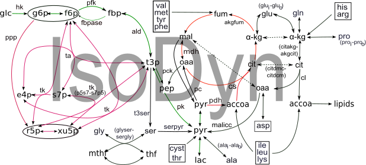

# IsoDyn
Version: 1.0
## “C++”-program that uses a kinetic model simulating the reactions in central metabolic network to calculate the dynamic of isotopic isomers spectra of metabolites.

## Description

“Isodyn” is a C++-program that performs an analysis of stable isotope tracer data to assess metabolic flux profiles in living cells. Isodyn simulates the dynamics of isotopic isomer (isotopomer) distribution in central metabolic pathways, and, by changing its parameters, which reflect the characteristics of corresponding biochemical reactions, fit the simulated dynamics of mass isotopomers to that observed experimentally. The simulated metabolic fluxes that correspond to the best fit are assumed to reproduce the real fluxes in the analyzed biological object and conditions. Isodyn contains tools that check the goodness of fit and perform a statistical analysis of obtained metabolic fluxes.

## Key features

- simulation of 13C mass isotopomer data obtained with GCMS, and corrected for natural occurring iso

## Functionality

- Post-processing
- Statistical Analysis
- Workflows

## Approaches

- Isotopic Labelling Analysis
    - 13C
    
## Data Analysis

- simulation of the mass isotopomer data, fitting them using a kinetic nodel, evaluation of metabolic fluxes corresponding to the best fit

## Instrument Data Types

- MS

## Screenshots

- screenshot of input data (format Metabolights), output is the same format with one more column added: corrected mass spectrum

## Tool Authors

- Vitaly Selivanov (Universitat de Barcelona)

## Container Contributors

- [Pablo Moreno](EBI)

## Website

- N/A

## Git Repository

- https://github.com/seliv55/isodyn

## Installation

- 1) As independent program. IsoDyn only requires compillation. Standing in the IsoDyn directory enter the commands:
  
'''  make clean '''

'''  make '''
  
  
- 2) As Docker image. To create the Docker container: 
     - go to the directory where the dockerfile is;
     - create container from dockerfile
''' sudo docker build -t isodyn:0.1 . '''

## Usage Instructions

  To run IsoDyn independently: standing in the MIDcor directory inside R environment, after reading the sources execute the command:
 
 ''' ./isodyn.out file_with_parameters, experimental_data_file  '''
 
  in the provided example parameters file is "1", experimental_data_file is "mglc"
 
  To run MIDcor as a docker image, execute
 
 '''  sudo docker run -i -t -v $PWD:/data isodyn:0.1 -i file_with_parameters experimental_data_file '''

## Publications

- 1: Selivanov VA, Vizán P, Mollinedo F, Fan TW, Lee PW, Cascante M.
Edelfosine-induced metabolic changes in cancer cells that precede the
overproduction of reactive oxygen species and apoptosis. BMC Syst Biol. 2010, 4:135.

- 2: de Mas IM, Selivanov VA, Marin S, Roca J, Orešič M, Agius L, Cascante M.
Compartmentation of glycogen metabolism revealed from 13C isotopologue
distributions. BMC Syst Biol. 2011, 5:175.

- 3: Selivanov VA, Marin S, Lee PW, Cascante M. Software for dynamic analysis of
tracer-based metabolomic data: estimation of metabolic fluxes and their
statistical analysis. Bioinformatics. 2006, 22(22):2806-12.

- 4: Selivanov VA, Meshalkina LE, Solovjeva ON, Kuchel PW, Ramos-Montoya A,
Kochetov GA, Lee PW, Cascante M. Rapid simulation and analysis of isotopomer
distributions using constraints based on enzyme mechanisms: an example from HT29 
cancer cells. Bioinformatics. 2005, 21(17):3558-64.

- 5: Selivanov VA, Puigjaner J, Sillero A, Centelles JJ, Ramos-Montoya A, Lee PW,
Cascante M. An optimized algorithm for flux estimation from isotopomer
distribution in glucose metabolites. Bioinformatics. 2004, 20(18):3387-97. 

